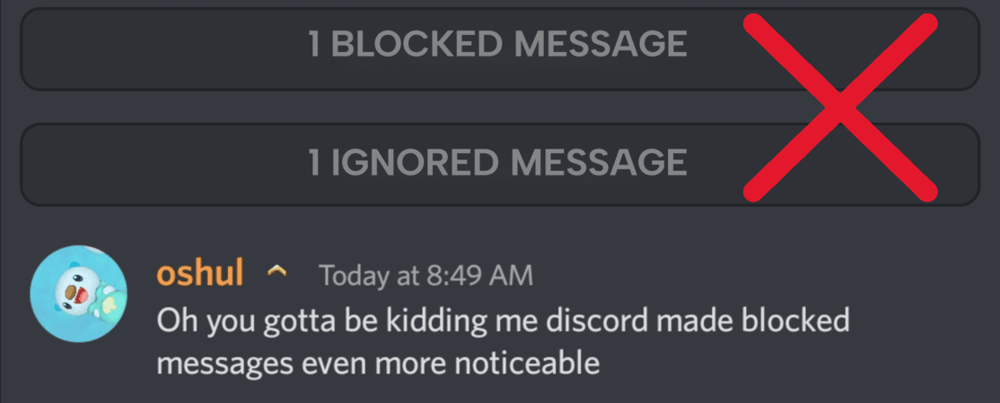
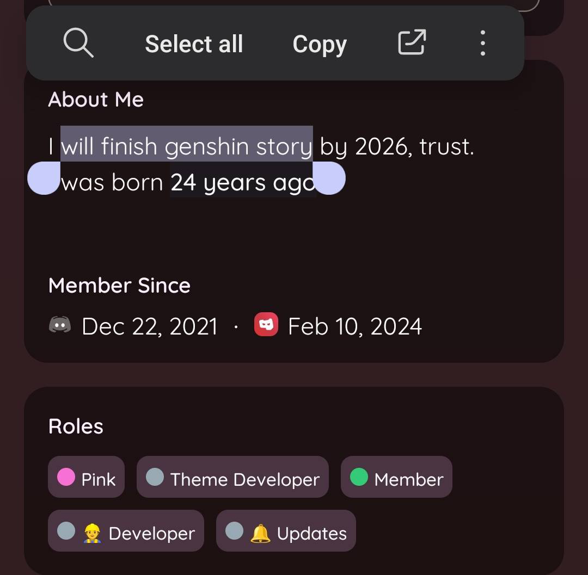
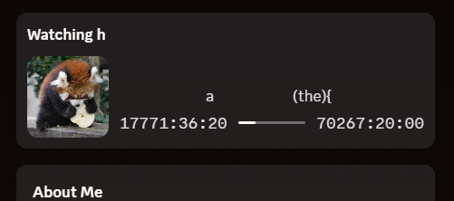
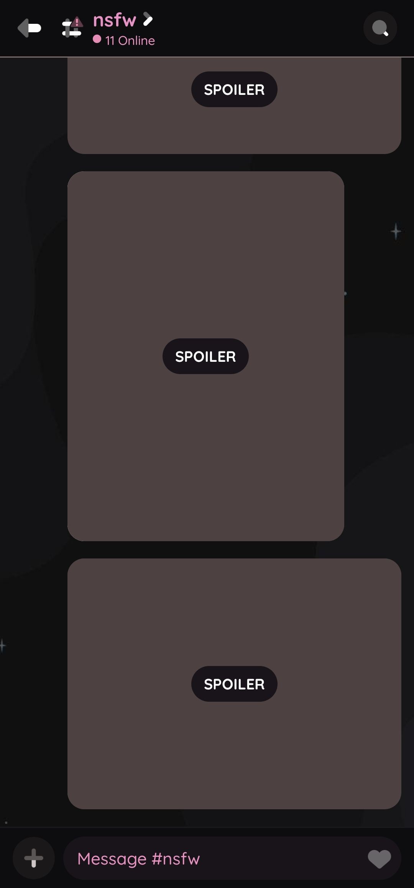
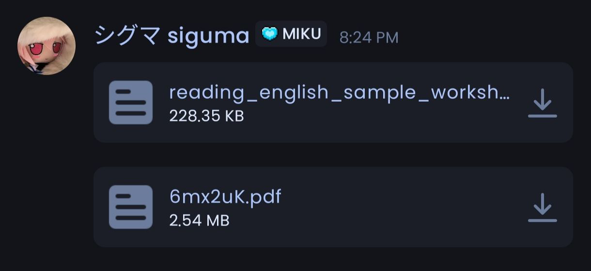
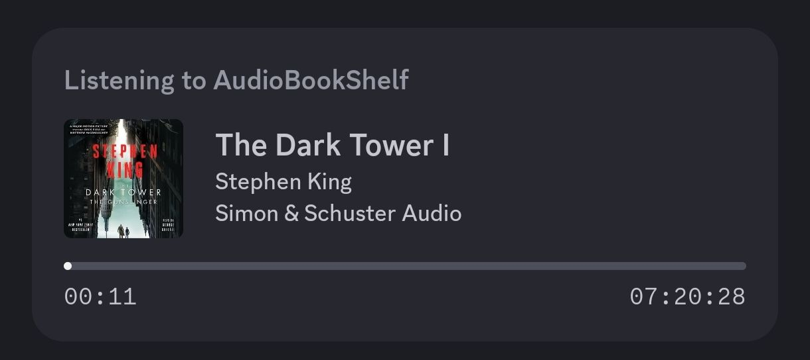
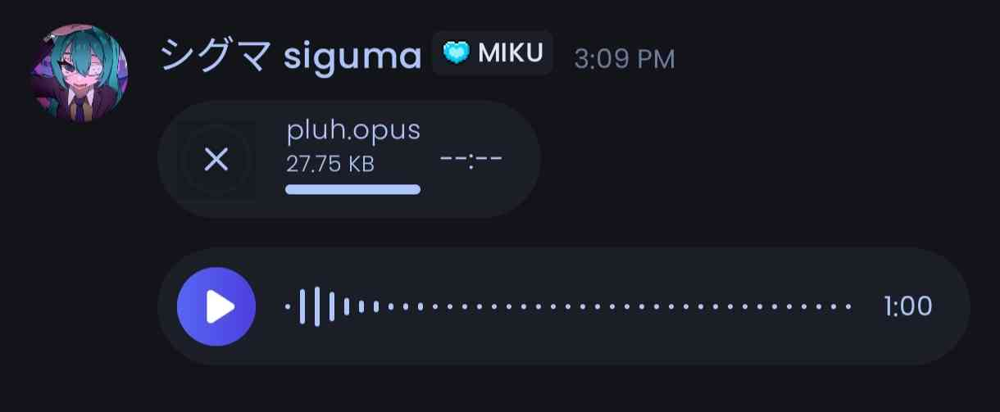
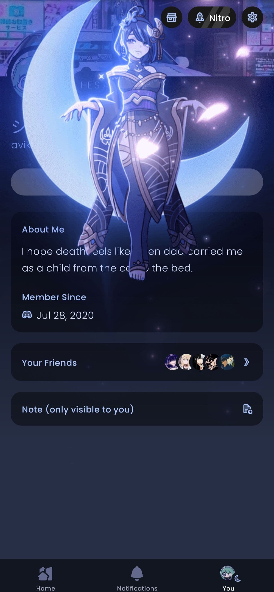

> **Note:** You accessed a link that returned a 404, probably by clicking one of the plugin links. You're supposed to copy the link address and add it into Vendetta.

# revenge/bunny/kettu plugins
A few vendetta plugins have been forked and are being maintained to work with it's successors [Revenge](https://github.com/revenge-mod/revenge-bundle),[Kettu](https://github.com/C0C0B01/Kettu)). Credit goes to the plugin devs for their respective work.

Based on [shipwr3ckd/revengeplugin](https://github.com/shipwr3ckd/revengeplugin) by シグマ siguma (CC0-1.0), with fixes for current Discord stable.

# How to install?
Copy and paste the plugin URL into your discord clients Plugins page.

# Plugins 
## HideBlockedAndIgnoredMessages 
A plugin that removes the `X blocked or ignored message/s` prompt and replies to the blocked or ignored messages from chat (optional in plugin settings).

> https://bleelblep.github.io/revengeplugins/HideBlockedAndIgnoredMessages/
<h3>

  
Preview

  

    

</h3>

## CopyBios 
Copy bio text.

> https://bleelblep.github.io/revengeplugins/CopyBios/
<h3>

  
Preview

  

    
  

</h3>

## catbox.moe
Upload your silly ahh files larger than 10MBs to catbox.moe.

> https://bleelblep.github.io/revengeplugins/catbox.moe/
<h3>

  
Preview

  

    
  

</h3>

## Silent Messages 
Send messages without notifying the receiver.

> https://bleelblep.github.io/revengeplugins/silentmessages/

## Rich Presence
Sets Discord Rich Presence for your profile.

> https://bleelblep.github.io/revengeplugins/RichPresence/
<h3>

  
Preview

  

    
  

</h3>

## NSFW Blur
Blur image previews and disable embed media in NSFW channels.

> https://bleelblep.github.io/revengeplugins/nsfw-blur
<h3>

  
Preview

  

    
  

</h3>

## Local Edit
Edit messages locally.

> https://bleelblep.github.io/revengeplugins/localedit
<h3>

  
Preview

  

    
  

</h3>

## AnonymousFileNames
Randomises file names before you upload them.

> https://bleelblep.github.io/revengeplugins/AnonymousFileNames
<h3>

  
Preview

  

    
  

</h3>

## AudioBookShelfRichPresence
Rich presence for AudioBookShelf media server.

> https://bleelblep.github.io/revengeplugins/ABSRPC
<h3>

  
Preview

  

    
  

</h3>

## Custom Voice Messages
Allows Sending any audio as a voice message.

> https://bleelblep.github.io/revengeplugins/customVoiceMessages
<h3>

  
Preview

  

    
  

</h3>

## Staff Tags
Shows extra tags for staff members.

> https://bleelblep.github.io/revengeplugins/staff-tags
<h3>

  
Preview

  

    
  

</h3>

## FakeProfileThemesAndEffects
Allows profile theming and the usage of profile effects by hiding the colors and effect ID in your About Me using invisible, zero-width characters.

> https://shipwr3ckd.github.io/FPTE/FakeProfileThemesAndEffects

<h3>

  
Preview

  

    
  

</h3>