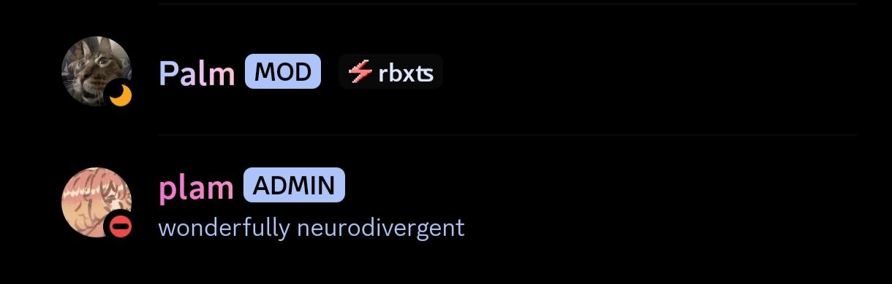

# revenge/bunny/kettu plugins

Vendetta plugins maintained to work with current Discord stable on its successors
[Revenge](https://github.com/revenge-mod/revenge-bundle) and [Kettu](https://github.com/C0C0B01/Kettu).
Credit goes to the original plugin devs for their respective work.

Forked from [shipwr3ckd/revengeplugin](https://github.com/shipwr3ckd/revengeplugin) by シグマ siguma (CC0-1.0).

Tested against **Discord 337.10** on **RevengeXposed 1.4.10**.

# How to install?
Copy the plugin URL below and paste it into your Discord client's Plugins page.

# Plugins

## Staff Tags
Shows extra tags for staff members — OWNER, ADMIN, STAFF, MOD, VC Mod, Chat Mod, WEBHOOK.

> https://bleelblep.github.io/revengeplugins/staff-tags/

<h3>
<details>
  <summary>Preview</summary>
  <p>
    
  </p>
</details>
</h3>

<details>
  <summary>Fixes applied for Discord 337.x</summary>

  - `metro.common.i18n` is a lazy getter that **throws** on this client
    (`bunny.metro.byProps(Messages) is undefined`). The plugin read `i18n.Messages` at
    module scope to build a list of built-in tag names, so importing it threw and the
    plugin could never be enabled. Optional chaining does not help — the getter throws
    rather than returning undefined. Built-in tags are now detected via `getBotLabel`,
    which needs no localised strings.
  - Permission helper is resolved across old and new names without destructuring the
    finder result.
  - Every patch guards its target module, so a moved module disables one surface instead
    of the whole plugin.
  - `DisplayName` and `HeaderName` no longer exist on this build, so profile and chat
    header tags are currently inactive. Chat messages and member-list rows work.

</details>

## Custom Timestamps
Customize the format of timestamps in chat — calendar, relative, ISO 8601, or a custom
[moment](https://momentjs.com/docs/#/displaying/format/) format string.

Originally by [Fiery](https://github.com/fierdetta/custom-timestamps).

> https://bleelblep.github.io/revengeplugins/custom-timestamps/

<details>
  <summary>Fixes applied for Discord 337.x</summary>

  - `message.timestamp` used to be a moment instance and the plugin called `.calendar()`
    on it directly. It is a plain string now, so every moment method was undefined —
    which threw from inside `RowManager.generate` and crashed the whole chat view.
    Timestamps are coerced through `moment()`, which handles strings, numbers, Dates and
    existing moments alike.
  - Both `generate` hooks are wrapped: they run on the chat render path, so anything
    escaping them takes the entire ChatView down rather than just breaking timestamps.
  - The `after` hook destructured `{ message }` from a return value that can be
    undefined — a second latent crash.
  - The settings text field resolved the input component as the module's `default`
    export. It is a named `InputView` export now, so the Custom option rendered nothing.

</details>

# Themes

Paste into your client's **Themes** page (not Plugins).

## Purple Galaxy
Originally by [VodkaXMartini](https://github.com/VodkaXMartini/VendettaTheme).

> https://bleelblep.github.io/revengeplugins/themes/PurpleGalaxy.json

<details>
  <summary>Fixes applied for Discord 337.x</summary>

  Discord renamed most of its semantic colour tokens, so **37 of the theme's 52 keys were
  dead** and simply ignored — the theme was barely applying. A theme can't crash the way a
  plugin does; unrecognised keys are silently skipped, so it just looked washed out.

  - Remapped 33 renamed keys, e.g. `BACKGROUND_PRIMARY`/`SECONDARY`/`TERTIARY` →
    `BACKGROUND_BASE_LOWER`/`LOWEST`/`LOW`, `TEXT_NORMAL` → `TEXT_DEFAULT`, and
    `INTERACTIVE_NORMAL`, which Discord split into `INTERACTIVE_TEXT_DEFAULT` **and**
    `ICON_DEFAULT`.
  - Filled 24 keys the theme never defined. This is what made forum and thread cards grey:
    the theme sets `CARD_SECONDARY_BG`, but Discord reads
    `CARD_SECONDARY_BACKGROUND_DEFAULT`. Unset keys fall back to Discord's default grey,
    and the theme's text colours were never meant to sit on grey.
  - Base surfaces are assigned by measured brightness rather than by old key name, so
    elevation reads correctly. The author's later `BG_BASE_*` keys had flattened three
    distinct purples into one; the richer original set is kept.
  - Trimmed a stray-whitespace hex value (`"#44429e  "`) that likely failed to parse.

  Every added key was verified against the client's 357 live semantic colours, and every
  value derives from a colour already in the theme. Legacy key names are kept — they are
  ignored here and keep the theme working on older clients.

  Recognised keys: **72/109**, up from 15/52.

  Not addressed: the four `SCROLLBAR_*` keys have no mobile equivalent, and the
  `background` (remote GIF at `alpha: 5`), `fonts` and `plus` blocks are untouched.

</details>

# Development

```sh
npm install
npm run build          # build all plugins into dist/
node serve.mjs --watch # build, then serve dist/ over LAN for on-device testing

npm i ws --no-save     # devtools.mjs only; kept out of package.json so the
node devtools.mjs      # CI lockfile stays in sync
```

`serve.mjs` prints a LAN install URL you can paste straight into the client, and rebuilds
on change. Note that console output is **not** forwarded over Revenge's debug websocket on
this build — `serve.mjs` exposes a `POST /collect` endpoint so a plugin can report
diagnostics directly instead.
